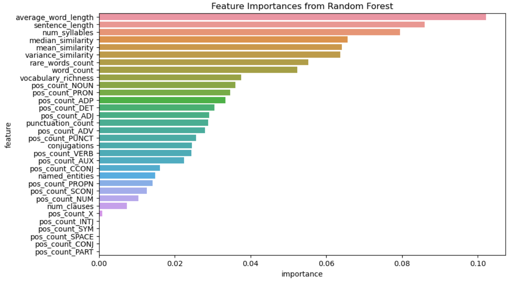
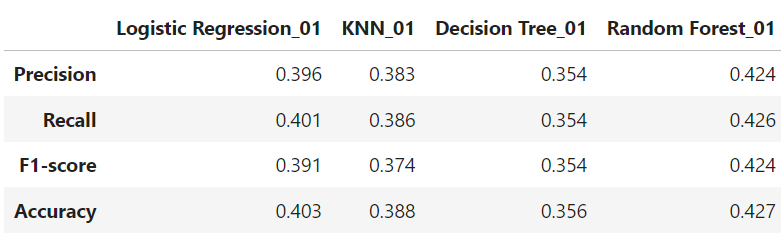
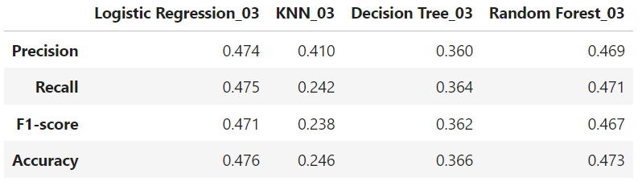
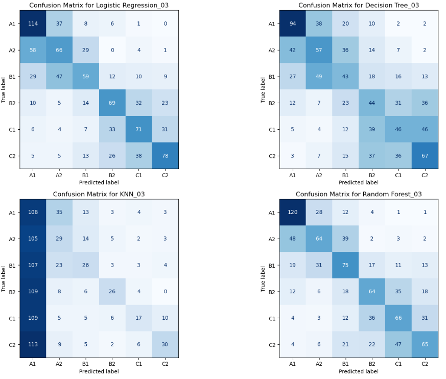

# Text Difficulty Classifier Project :books:

## What is this Project? 🤔
The Text Difficulty Classifier is a machine learning project aimed at classifying text into various difficulty levels according to the Common European Framework of Reference for Languages (CEFR). 
Our model processes text excerpts from books to determine if it is suited for beginners (A1, A2), intermediate (B1, B2), or advanced (C1, C2) learners.

## Why You Won't Regret Reading Until the End? 🌟
By the end of this README, you'll have a comprehensive understanding of how machine learning can be used for text difficulty classification. 
Plus, we've included a special video demonstration and insights from our latest Kaggle competition and a cool application of text difficulty classification!

### A note on Text Difficulty :sweat_smile:
Language proficiency into levels A1, A2, B1, B2, C1, and C2, relies on various linguistic and structural features such as:
1. **Vocabulary** :books:
   - **Frequency and Commonality**: Texts for beginners (A1, A2) tend to use high-frequency vocabulary and common words. As the level increases, the frequency of usage decreases, and the rarity or specificity of vocabulary increases.
   - **Lexical Density**: Advanced texts (C1, C2) often have a higher density of lexical items (nouns, adjectives, adverbs, and verbs), meaning there is a greater variety of words used with fewer repetitions.

2. **Grammatical Complexity** :memo:
   - **Sentence Structure**: Basic texts use simple sentences, intermediate texts introduce compound sentences, and advanced texts use complex sentences with multiple clauses.
   - **Grammatical Features**: Advanced texts employ a wider range of verb tenses, moods (such as subjunctive), passive constructions, and conditionals.
   
3. **Conceptual Complexity and Abstractness** :bulb:
   - Topics covered in texts for higher proficiency levels often involve abstract concepts, specialized knowledge areas, and philosophical debates, as opposed to the concrete, everyday topics typically discussed in beginner texts.

4. **Cultural and Idiomatic Elements** :earth_americas:
   - Advanced texts may include idioms, cultural references, and expressions that are challenging for lower-level learners to understand without specific cultural knowledge or advanced language skills.

### Why Text Difficulty Classification is Relevant :mag:
Learning a new language can easily become overwhelming without the appropriate material. Text difficulty classification can serve as an educational guide for content creators to:

1. :mortar_board: **Design appropriate exercises** and reliable language proficiency tests.

2. :open_book: **Select suitable reading materials**. Too easy texts won't aid learning effectively, whereas too difficult texts could demotivate learners.

4. :robot: **Automatically adjust content** depending on the user’s proficiency, enhancing personalized learning. 

5. :wheelchair: **Ensuring content is accessible for readers of various proficiency levels**, particularly in multilingual contexts.

## Meet the Team! 👥
- **Camille** - The Logistic regression and decision tree expert, corageous enough to dive into the advanced CamemBERT techniques! and a worderful video producer.
- **Mariana** - The data preprocessing, kNN and Random Forest expert that loves writting read me files and implementing text classifiers into streamlit apps.

## The Menu 📖
- [The Data We Used](#the-data-we-used)
- [Coding: Machine Learning Techniques](#coding-using-machine-learning-techniques)
- [Video Demonstration](#video-demonstration)
- [Kaggle Competition Rank](#kaggle-competition-rank)
- [Results](#results)
- [Conclusion](#conclusion)

## The Data We Used 📊
We utilized a corpus consisting of 4800 sentences ranging from A1 to C2 levels.
Then we asked ourselves:
**What defines a sentence complexity?** ✍❓
The length of the sentence, The richness of the vocabulary, The grammar or the syntax?
Before diving into machine learning models we will translate sentences into metrics and numbers.
We selected the following features to explore:
1. Word count: total tokens considered as words in the sentence.
2. Average word length
3. Sentence_length: total number oh characters
4. Rare words count
5. Number of syllables
6. Vocabulary richness
7. POS Tags Distribution: Proportion of different parts of speech (nouns, verbs, adjectives, etc.).
8. Number of clauses
9. Punctuation count
10. Named entities: words that are names of persons, organizations, locations, dates etc.
11. Conjugations
12. Word similarity: mean, median and variance of the pairwise cosine similarity between the word vectors 

Are ALL these features useful though? To answer this we will perform an RFE (recursive feature elimination) ranking with the Random Forest model. This will give us a meassure of the features' importance so that we can reduce dimensionality, simplifying the model and reducing overfitting.

Interesting isn't it? :eyes: this gives us an innitial guiding light to train machine learning models on french sentences classifications. We will select the features: ['word_count', 'mean_similarity', 'median_similarity', 'num_syllables', 'variance_similarity', 'average_word_length', 'sentence_length', 'rare_words_count']
and a word frequency metric called TF-IDF to build basic and advanced models. Keep reading!:point_down:

## Coding: Using Machine Learning Techniques to Classify Text Difficulty 🖥️
We first started training models with the features listed above and using the following techniques:
- Logistic Regresssion
- KNN
- Decision Tree
- Random Forest
  

Random Forest performed the best with a 0.427 accuracy (Far away from what we want to achieve though). We will now reflect on what the strengths and weaknesses of model are to explain these results and define next steps.

**Logistic Regression** is a linear model used for binary and multiclass classification by estimating class belonging probabilities with a logistic (sigmoid) function that is applied to the weighted sum of the input features. It is simple, interpretable, and works well with sparse data like TF-IDF features but as it is a linear model, it might struggle with complex, non-linear relationships in the data for example contextual information.
Also the boundaries between A1-A2, B1-B2, and C1-C2 seem to be difficult to find as we can see from the confusion matrix highliting the limitation of a Logistic Regression linear boundary.

**Decision Tree** splits the data into subsets based on feature values in a way that nodes represents features, branches decision rules, and leaves a class labels. The tree is built by choosing the feature that best separates the data according to a criterion like Gini impurity or information gain. It can capture non-linear relationships, are easy to interpret but they can easily overfit, especially with high-dimensional data like TF-IDF vectors. For example in the case of text classification, a Decision Tree might split the data first on the presence of a specific word or word frequency, then further split on other words or features until it reaches a decision.

**Random Forest** is an ensemble of Decision Trees. Each tree is trained on a random subset of the data and features, and their predictions are combined (usually by voting) to make the final prediction which reduces overfitting and improves generalization. They handle well non-linear relationships, are less prone to overfitting and can manage high-dimensional data but they are more complex and harder to interpret. In our example Random Forests would build multiple Decision Trees, each potentially focusing on different features or frequencies. The ensemble would combine these to provide a robust classification.

**K-Nearest Neighbors (KNN)** is a non-parametric, instance-based learning algorithm thet classifies a data point based on the majority class of its `k` nearest neighbors in the feature space. It is simple and intuitive, can capture local patterns in the data but can be computationally expensive with large datasets, as it requires storing and comparing all training samples. It can also struggle with high-dimensional data due to the curse of dimensionality.

Knowing this we will follow 2 main strategies, we will introduce **TF-IDF vectorization** to the training features and we will use **cross validation** and **hyperparameter fine-tunning** to improve our models.  

After introducing TF-IDF (Term Frequency Inverse Document Frequency of records) we found out that for almost all the models the highest accuracies were obtained when training the models with both text features and word frequencies which makes sense since language difficulty is much more complicated than just word frequencies. Here a classification report for the 4 models trained with this combined approach:

And here the confusion matrices for the four models. Do you find something interesting?🧐

It was stricking to see such a poor performance from the KNN classifier on the sentences vectorized with TFIDF so we decided to dive a bit deeper and try to find the way to improve it. It could be that default number of neighboors for the KNN Classifier (5) is not the best or, maybe giving more weight to closer neighbors could help or the euclidean distance (the line length between two points) might not be appropriate... We will use Bayesian optimisation to answer these questions.

## Now the moment you have been waiting for...The camemBERT ##

Next, we explored the CamemBERT model. Our approach involved three key steps to enhance the accuracy score:
1. We adjusted the model parameters to improve performance.
2. We preprocessed the text by lemmatizing it.
3. We experimented with two data augmentation techniques using synonym replacement. The first technique replaced words with similar ones based on their embeddings, and the second used synonyms retrieved from NLTK's WordNet.

## Video Demonstration 🎥
This model is so cool that it deserves a multimedia explanation so we will stop the bla bla in this text and invite you to check out this video showing an amazing application of our text classifier:
https://youtu.be/ROy3S0kd6yE

## Kaggle Competition Rank 🏆
Our model ranked ...
With a score of ...
You can view the full competition details here.

## Results 📈

## Conclusion 🎉

## Now we invite you to discover our app
https://lepetitprofcodespaces-nkb4dbpgbmujkcuhf7sey5.streamlit.app/

# Embed a GIF from Giphy

    
    
<a href="https://giphy.com/gifs/orchfilms-orchard-films-the-little-prince-invisible-essence-SIaHSy7gMCCYru0bbu">via GIPHY</a>

